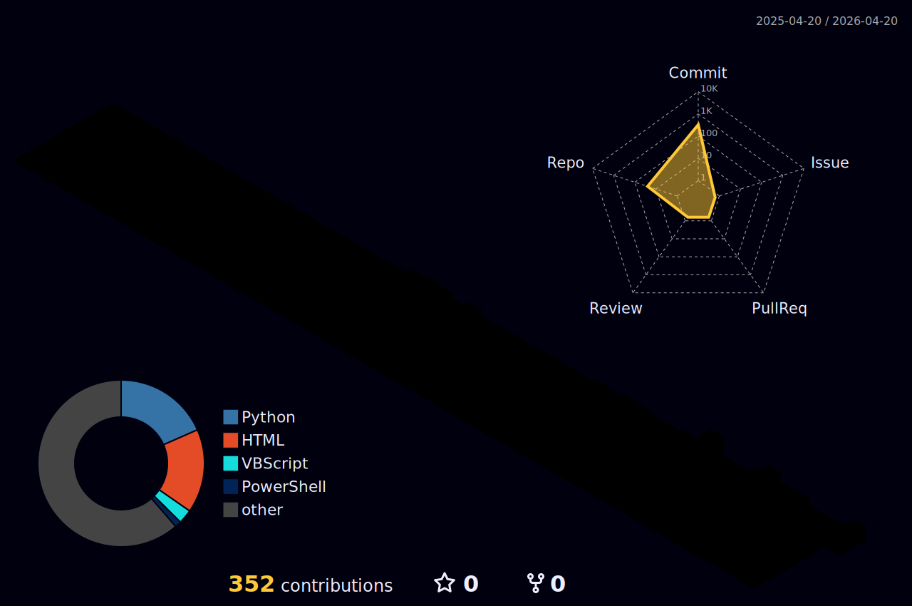

<p align="center">
  
</p>

<div align="center">


**[👨‍💻 Pesonal Website](https://cyberpeacemaker.github.io/)** 
**[📄 Cybersecurity Resume](https://cyberpeacemaker.github.io/inf-resume/)**

</div>

# `0x00` // About Me
```c
#include <stdio.h>

void secret_function() {
    printf("\n[!!!] BUFFER OVERFLOW DETECTED: Stack smashed successfully.\n");
    printf("================= ACCESSING PROTECTED DATA =================\n");
    printf(" HANDLE:   CyberPeaceMaker\n");
    printf(" ROLE:     Security Researcher & Binary Analyst\n");
    printf(" STACK:    Reverse Engineering | Forensics | Pwn\n");
    printf(" TOOLS:    GDB, IDA Pro, Pwntools, Wireshark, Python\n");
  
}

void greet_visitor() {
    char greeting[16];
    printf("[*] Welcome, traveler. How would you like to greet me?\n");
    
    // No bounds checking on input ( •̀ ω •́ )✧
    gets(greeting); 

    printf("[+] Status: Thanks for stopping by! Have a secure day. 🌱\n");
}

int main() {
    greet_visitor();
    return 0;
}
```
[;%5B!%5D+STACK+SMASHED!+Redirecting+to+secret_function())](https://git.io/typing-svg)

# `0x01` // Current Directives

### **Digital Forensics**
`[ FOUNDATIONAL ]` ◦ Competent ◦ Advanced ◦ Expert  
**●▬▬▬▬▬▬▬▬▬**○────────○─────○────○

### **Reverse Engineering**
`[ FOUNDATIONAL ]` ◦ Competent ◦ Advanced ◦ Expert  
**●▬▬▬▬▬▬▬▬▬**○────────○─────○────○  
### **Binary Exploitation**
`[ FOUNDATIONAL ]` ◦ Competent ◦ Advanced ◦ Expert  
**●▬▬▬▬▬▬▬▬▬**○────────○─────○────○

# 0x02
- Threat Hunting
- Threat Intelligince

# 0x03


- 🌱 I'm currently learning **Protocol Dissector and Reverse Engineering**

- 👯 I'm looking to collaborate on **APT Threat Hunting**

- 📫 How to reach me **a47u0905@gmail.com**

# Current Project Focus

<h3 align="left">Connect with me:</h3>
<p align="left">
<a href="https://github.com/cyberpeacemaker" target="blank"></a>
</p>





<p></p>

