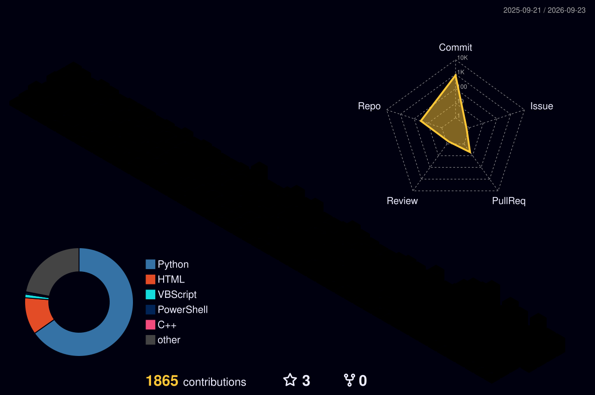

<p align="center">
  
</p>

<div align="center">

**[👨‍💻 Pesonal Website](https://cyberpeacemaker.github.io/)** 
**[📄 Cybersecurity Resume](https://cyberpeacemaker.github.io/inf-resume/)**


</div>

# `0x00` // About Me
```c
#include <stdio.h>

void secret_function() {
    printf("\n[!!!] BUFFER OVERFLOW DETECTED: SECRET INFO REVEAL ヾ(≧▽≦*)o !\n");
    printf("================= ACCESSING PROTECTED DATA =================\n");
    printf(" HANDLE:   CyberPeaceMaker\n");
    printf(" ROLE:     Security Researcher & Binary Analyst\n");
    printf(" STACK:    Reverse Engineering | Forensics | Pwn\n");
    printf(" TOOLS:    GDB, IDA Pro, Pwntools, Wireshark, Python\n");
  
}

void greet_visitor() {
    char greeting[16];
    printf("[*] Welcome, traveler. How would you like to greet me?\n");
    
    // No bounds checking on input ( •̀ ω •́ )✧
    gets(greeting); 

    printf("[+] Status: Thanks for stopping by! Have a secure day. 🌱\n");
}

int main() {
    greet_visitor();
    return 0;
}
```
[;%5B!%5D+STACK+SMASHED!+Redirecting+to+secret_function();%5B!!!%5D+BUFFER+OVERFLOW+DETECTED%3A+SECRET+INFO+REVEAL+%E3%83%BE(%E2%89%A7%E2%96%BD%E2%89%A6*)o+!)](https://git.io/typing-svg)

<blockquote align="left">
  <font color="#ff5555"><b>[!] ATTENTION:</b></font> 
  <code>Anomalous access detected! Full scan in progress...</code><br>
  <font color="#50fa7b"><b>[✓] VIRTUAL_SHIELD:</b></font> 
  <i>Data secured. No exfiltration detected. Safe and sound o((>ω< ))o !!</i>
</blockquote>
<br>

# `0x01` // Current Directives

<table width="100%">
  <tr>
    <td align="left">🔍 <b>Digital Forensics</b></td>
    <td align="center">▰▰▰▱▱▱▱▱▱▱</td>
    <td align="right"><b>Foundational</b></td>
  </tr>
  <tr>
    <td align="left">🛠️ <b>Reverse Engineering</b></td>
    <td align="center">▰▰▰▰▱▱▱▱▱▱</td>
    <td align="right"><b>Competent</b></td>
  </tr>
  <tr>
    <td align="left">💥 <b>Binary Exploitation</b></td>
    <td align="center">▰▰▱▱▱▱▱▱▱▱</td>
    <td align="right"><b>Foundational</b></td>
  </tr>
</table>


# 0x02 Mission Parameters

<table width="100%">
  <!-- Terminal-style Header -->
  <tr>
    <td colspan="20" align="center" bgcolor="#0d1117">
      <font color="#39ff14" face="monospace"><b>[ TERMINAL.GOAL_INIT ] - SHIELD THE INNOCENT // DISRUPT THE MALICIOUS</b></font>
    </td>
  </tr>
  
  <!-- Strategic Pillars -->
  <tr>
    <td colspan="5" align="center" width="25%"><b>OPERATIONAL<br>FOUNDATION</b></td>
    <td colspan="5" align="center" width="25%"><b>THREAT<br>INTELLIGENCE</b></td>
    <td colspan="5" align="center" width="25%"><b>CYBER CRIME<br>NEUTRALIZATION</b></td>
    <td colspan="5" align="center" width="25%"><b>STRATEGIC<br>PEACEKEEPING</b></td>
  </tr>
  
  <!-- Capability Tracks -->
  <tr>
    <td colspan="4" align="center" width="20%"><code>CERTIFICATIONS</code></td>
    <td colspan="4" align="center" width="20%"><code>CTF_OPS</code></td>
    <td colspan="4" align="center" width="20%"><code>R&D_PROJECTS</code></td>
    <td colspan="4" align="center" width="20%"><code>INTEL_BRIEFS</code></td>
    <td colspan="4" align="center" width="20%"><code>WHITEPAPERS</code></td>
  </tr>
</table>

## 2026
- job
- reverse enginner, packet analysis


#

<p align="center"></p>




# Connect With Me

<p align="left">
<a href="https://github.com/cyberpeacemaker" target="blank"></a>
</p>
