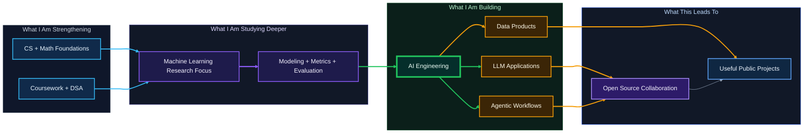

```mermaid
%%{init: {"theme": "base", "flowchart": {"curve": "cardinal"}, "themeVariables": {"background": "#0D1117", "primaryColor": "#102A4A", "primaryTextColor": "#EAF6FF", "primaryBorderColor": "#36BCF7", "lineColor": "#94A3B8", "tertiaryColor": "#161B22"}}}%%
flowchart LR
    subgraph Preparation["What I Am Strengthening"]
    direction TB
        Core["CS + Math Foundations"]:::foundation
        DSA["Coursework + DSA"]:::foundation
    end

    subgraph Specialization["What I Am Studying Deeper"]
    direction TB
        ML["Machine Learning Research Focus"]:::research
        Eval["Modeling + Metrics + Evaluation"]:::research
    end

    subgraph Practice["What I Am Building"]
    direction TB
        Eng["AI Engineering"]:::engineering
        LLM["LLM Applications"]:::applied
        Agent["Agentic Workflows"]:::applied
        Data["Data Products"]:::applied
    end

    subgraph Outcome["What This Leads To"]
    direction TB
        OSS["Open Source Collaboration"]:::community
        Portfolio["Useful Public Projects"]:::portfolio
    end

    Core --> ML
    DSA --> ML
    ML --> Eval
    Eval ==> Eng
    Eng --> LLM
    Eng --> Agent
    Eng --> Data
    LLM --> OSS
    Agent --> OSS
    Data --> Portfolio
    OSS --> Portfolio

    classDef foundation fill:#102A4A,stroke:#36BCF7,stroke-width:2px,color:#EAF6FF;
    classDef research fill:#1E1B4B,stroke:#8B5CF6,stroke-width:2px,color:#F5F3FF;
    classDef engineering fill:#052E2B,stroke:#22C55E,stroke-width:4px,color:#ECFDF5;
    classDef applied fill:#3B2506,stroke:#F59E0B,stroke-width:2px,color:#FFFBEB;
    classDef community fill:#2D1B69,stroke:#A78BFA,stroke-width:2px,color:#F5F3FF;
    classDef portfolio fill:#0F2742,stroke:#60A5FA,stroke-width:2px,color:#EFF6FF;

    style Preparation fill:#0F172A,stroke:#233044,stroke-width:1px,color:#CBD5E1
    style Specialization fill:#111827,stroke:#312E81,stroke-width:1px,color:#DDD6FE
    style Practice fill:#0B1F1A,stroke:#14532D,stroke-width:1px,color:#BBF7D0
    style Outcome fill:#111827,stroke:#1D4ED8,stroke-width:1px,color:#BFDBFE

    linkStyle 0,1 stroke:#36BCF7,stroke-width:2.5px;
    linkStyle 2 stroke:#8B5CF6,stroke-width:3px;
    linkStyle 3,4,5 stroke:#22C55E,stroke-width:2.5px;
    linkStyle 6,7,8,9 stroke:#F59E0B,stroke-width:2.5px;
```

