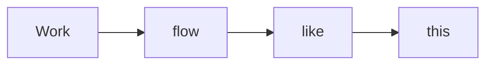

---
title: Level up your documentation with HackMD
tags: [onboarding]

---

# Level up your documentation with HackMD

[](https://hackmd.io/wKVEaNZ3RjCp8Sm3nZRgIw)


We understand that efficiency and seamless collaboration are crucial to you. Whether you're a seasoned user or feeling confident with the basics, this guide is designed to help you level up your documentation game. 

Dive into advanced features, like the GitHub integration or HackMD API, that can transform and streamline your workflows. 

Let's get started!

## What we'll cover
- [Team workspace](#Team-workspace)
- [Sync with GitHub](#Sync-with-GitHub)
- [API calls](#API-calls)
- [Book mode](#Book-mode)
- [Custom templates](#Custom-templates)
- [Embed notes](#Embed-notes)
- [LaTeX & MathJax](#LaTeX-amp-MathJax)
- [UML diagrams](#UML-diagrams)
- [Further learning](#Further-learning)

## Team workspace
A team workspace is a great place to organize internal documents and share knowledge. 

Creating your Team Workspace is simple:
1. In "My Workspace," click "Create new team" from the sidebar.
2. Name your team, add a description, and you're ready to start inviting others!


Once your team is set up, you can easily prep for and debrief from meetings. Create product road-maps, post-mortems, technical design docs, brainstorming, and anything in between, all in one place. You can even invite external collaborators to edit specific notes.

:::success
Free teams can have up to 3 members, and when you create a team workspace, more detailed team space guidelines will appear in the team workspace.
:::


## Sync with GitHub
Sync your HackMD notes directly to your GitHub account to keep your workflows in sync. Push notes to or pull files from GitHub in just a few clicks.

Here's how it works:

1. Install [the HackMD GitHub app](https://github.com/apps/hackmd-hub)[target=_blank] on your GitHub account
2. Connect and authorize your account and repositories
3. Start syncing!

What are the benefits of linking with GitHub?
- View and control note versions at any time
- Cross-platform compatibility of note files, allowing edits anytime and anywhere
- Flexible document management and issue discussion, collaborating on HackMD or using Pull Requests/Issues on GitHub

[ → Read more about the GitHub integration here and get started.](https://hackmd.io/c/tutorials/%2F%40docs%2Fsync-a-note-with-github?utm_source=prepopulatednote&utm_medium=editor&utm_campaign=experttutorial&utm_content=tutorial)

## API calls
We support simple API functionalities, including... 
- Creating
- Retrieving
- Updating
- Deleting

This includes tasks like creating meeting notes automatically or integrating with third-party services, like Telegram and Discord.

Whether you're organizing projects, streamlining your team's collaboration, or automating your personal flow -- the HackMD API helps you take back control and work smarter.

[ → Learn how to use the HackMD API here and get started.](https://hackmd.io/c/tutorials/%2F%40docs%2Fissue-revoke-api-token-en?utm_source=prepopulatednote&utm_medium=editor&utm_campaign=experttutorial&utm_content=tutorial)

Can't find what you're looking for? The HackMD team is continually adding more features. If you have suggestions for API functionalities you'd like to see, please let us know!

## We value your feedback!
Did you find this guide helpful? Answer one question in [this survey](https://tally.so/r/mYzAez) and let us know.

## Book mode
Collect and categorize related notes together as a "book" in HackMD. This allows you to easily share all of your project documentation at once.

Here's how...
1. Create a new note.
2. Choose a title (and section titles if you're 🔥).
3. Add links (the body of your book).
4. In the "Sharing" menu, choose "Book Mode".
5. Publish!


[ → Learn more about creating a book here](https://hackmd.io/c/tutorials/%2F%40docs%2Fcreate-a-book-en?utm_source=prepopulatednote&utm_medium=editor&utm_campaign=experttutorial&utm_content=tutorial)

## Custom templates
Find yourself creating the same document outline over and over? You can make your own template within HackMD.

1. To get started, create the document you'd like to save as a template. 
2. Click on the `...` at the top right of your screen.
3. Click "Save as template"
4. Give your template a name and click "OK".


## Embed notes

Embedding notes saves you time from repetitive work. Want to apply different themes, layouts, or set text colors to your notes? HackMD's CSS support and embed note feature makes this possible. 

Here's how it works:

1. Prepare a note with only the content you want to embed. 
2. Get its unique note ID (found after the `/` in the URL).
3. Start embedding an iframe by adding `` where you want to embed the note. 
4. Specify the note ID and you're set!


>[!Tip]What is Note ID?
>Note ID is a random code that appear at the end of the note sharing link.
>
>Take this link for example: `https://hackmd.io/@username/HyAhMOgiA`
--> `HyAhMOgiA` is the note ID.

## We value your feedback!
Did you find this guide helpful? Answer one question in [this survey](https://tally.so/r/mYzAez) and let us know.

## LaTeX & MathJax
LaTeX is a high-quality typesetting system for anyone creating mathematical documentation on the internet. And [MathJax](https://hackmd.io/c/tutorials/%2Fs%2FMathJax-and-UML?utm_source=prepopulatednote&utm_medium=editor&utm_campaign=experttutorial&utm_content=tutorial) is a tool that brings the power of LaTeX to your fingertips.

Here are a few implementations of LaTeX and MathJax:

1. **Simple formulas:** Add a dollar sign `$` to the front and back of your mathematical formula or equation to render the current MathJax. 

For example: Write this`$12+6=18$` to show this $12+6=18$.

2. **Enclosed formulas:** Insert two consecutive dollar signs, `$$`, before and after your equation to create in-line notations.

For example:
```
$$
e^{ \pm i\theta } = \cos \theta \pm i\sin \theta
$$
```

$$
e^{ \pm i\theta } = \cos \theta \pm i\sin \theta
$$

&nbsp;

3. **Superscripts and subscripts:** Use `^` and `_` to indicate  super and subscript variations.

For example:

```
$$
y^2 = 2x+16
$$
```

$$
y^2 = 2x+16
$$

4. **Fractions:** Write `\over` or `\frac` to create fractions.

[ → Explore the full list of uses here](https://math.meta.stackexchange.com/questions/5020/mathjax-basic-tutorial-and-quick-reference?utm_source=prepopulatednote&utm_medium=editor&utm_campaign=experttutorial&utm_content=tutorial)

## UML diagrams
A Unified Modeling Language diagram -- or UML diagram -- acts as a visual representation of systems and software.

Here are a few implementations of UML diagrams:

### Mermaid diagrams
1. Enter ` ```mermaid ` before the following notation.
2. Copy and paste the syntax below, then replace the sample text with your process.
3. Break line and enter ` ``` `.
```
graph LR

Work --> flow --> like --> this
```



### Sequence diagrams
1. Enter ` ```sequence ` before the following notation.
2. Copy and paste the syntax below, then replace the sample text with your process.
3. Break line and enter ` ``` `.

```
Lucy->Robbie: Hello Robbie, how are you?
Note right of Robbie: Robbie thinks
Robbie-->Lucy: I'm good, thanks!
```

```sequence
Lucy->Robbie: Hey Robbie, how are you?
Note right of Robbie: Robbie thinks
Robbie-->Lucy: I'm good, thanks!
```

[ → Read more about the UML diagrams supported on HackMD](https://hackmd.io/c/tutorials/%2F%40docs%2Fuse-mathjax-and-UML-en#How-to-use-MathJax-amp-UML?utm_source=prepopulatednote&utm_medium=editor&utm_campaign=experttutorial&utm_content=tutorial)

## Further learning
Want to learn more ways you can use HackMD? Check out the Beginner and Markdown guides in your workspace. 

The Beginner Guide covers:
- Workspace & sidebar
- Personal workspace
- Create a note
- Start with a template
- Insert images & gifs
- Comments
- Suggest edit
- Share & set permissions
- Publishing

The Markdown Guide covers:
- Markdown syntax
- Text styles
- Tables
- Table of contents
- Extensions
- Edit vs View pages

Before you go, HackMD has an official user manual with instructions for all its features!

In our tutorial book, you'll find detailed guides to all the main features of HackMD that boost your productivity.

### :point_right: [HackMD Tutorial Book](https://hackmd.io/c/tutorials/%2Fs%2Ftutorials?utm_source=prepopulatednote&utm_medium=editor&utm_campaign=experttutorial&utm_content=tutorial) :point_left:

Don't want to miss the latest news and feature updates from HackMD? Be sure to follow our social channels or join us on Discord.

- :mailbox: support@hackmd.io
- <i class="fa fa-file-text"></i> [X (Twitter)](https://x.com/hackmdio)
- <i class="fa fa-file-text"></i> [Facebook](https://www.facebook.com/hackmdio)
- <i class="fa fa-file-text"></i> [LinkedIn](https://www.linkedin.com/company/hackmd)
- <i class="fa fa-file-text"></i> [Discord](https://discord.gg/rAkfPd5Z)

## We value your feedback!
Did you find this guide helpful? Answer one question in [this survey](https://tally.so/r/mYzAez) and let us know.
---
title: Level up your documentation with HackMD
tags: [onboarding]

---

# Level up your documentation with HackMD

[](https://hackmd.io/wKVEaNZ3RjCp8Sm3nZRgIw)


We understand that efficiency and seamless collaboration are crucial to you. Whether you're a seasoned user or feeling confident with the basics, this guide is designed to help you level up your documentation game. 

Dive into advanced features, like the GitHub integration or HackMD API, that can transform and streamline your workflows. 

Let's get started!

## What we'll cover
- [Team workspace](#Team-workspace)
- [Sync with GitHub](#Sync-with-GitHub)
- [API calls](#API-calls)
- [Book mode](#Book-mode)
- [Custom templates](#Custom-templates)
- [Embed notes](#Embed-notes)
- [LaTeX & MathJax](#LaTeX-amp-MathJax)
- [UML diagrams](#UML-diagrams)
- [Further learning](#Further-learning)

## Team workspace
A team workspace is a great place to organize internal documents and share knowledge. 

Creating your Team Workspace is simple:
1. In "My Workspace," click "Create new team" from the sidebar.
2. Name your team, add a description, and you're ready to start inviting others!


Once your team is set up, you can easily prep for and debrief from meetings. Create product road-maps, post-mortems, technical design docs, brainstorming, and anything in between, all in one place. You can even invite external collaborators to edit specific notes.

:::success
Free teams can have up to 3 members, and when you create a team workspace, more detailed team space guidelines will appear in the team workspace.
:::


## Sync with GitHub
Sync your HackMD notes directly to your GitHub account to keep your workflows in sync. Push notes to or pull files from GitHub in just a few clicks.

Here's how it works:

1. Install [the HackMD GitHub app](https://github.com/apps/hackmd-hub)[target=_blank] on your GitHub account
2. Connect and authorize your account and repositories
3. Start syncing!

What are the benefits of linking with GitHub?
- View and control note versions at any time
- Cross-platform compatibility of note files, allowing edits anytime and anywhere
- Flexible document management and issue discussion, collaborating on HackMD or using Pull Requests/Issues on GitHub

[ → Read more about the GitHub integration here and get started.](https://hackmd.io/c/tutorials/%2F%40docs%2Fsync-a-note-with-github?utm_source=prepopulatednote&utm_medium=editor&utm_campaign=experttutorial&utm_content=tutorial)

## API calls
We support simple API functionalities, including... 
- Creating
- Retrieving
- Updating
- Deleting

This includes tasks like creating meeting notes automatically or integrating with third-party services, like Telegram and Discord.

Whether you're organizing projects, streamlining your team's collaboration, or automating your personal flow -- the HackMD API helps you take back control and work smarter.

[ → Learn how to use the HackMD API here and get started.](https://hackmd.io/c/tutorials/%2F%40docs%2Fissue-revoke-api-token-en?utm_source=prepopulatednote&utm_medium=editor&utm_campaign=experttutorial&utm_content=tutorial)

Can't find what you're looking for? The HackMD team is continually adding more features. If you have suggestions for API functionalities you'd like to see, please let us know!

## We value your feedback!
Did you find this guide helpful? Answer one question in [this survey](https://tally.so/r/mYzAez) and let us know.

## Book mode
Collect and categorize related notes together as a "book" in HackMD. This allows you to easily share all of your project documentation at once.

Here's how...
1. Create a new note.
2. Choose a title (and section titles if you're 🔥).
3. Add links (the body of your book).
4. In the "Sharing" menu, choose "Book Mode".
5. Publish!


[ → Learn more about creating a book here](https://hackmd.io/c/tutorials/%2F%40docs%2Fcreate-a-book-en?utm_source=prepopulatednote&utm_medium=editor&utm_campaign=experttutorial&utm_content=tutorial)

## Custom templates
Find yourself creating the same document outline over and over? You can make your own template within HackMD.

1. To get started, create the document you'd like to save as a template. 
2. Click on the `...` at the top right of your screen.
3. Click "Save as template"
4. Give your template a name and click "OK".


## Embed notes

Embedding notes saves you time from repetitive work. Want to apply different themes, layouts, or set text colors to your notes? HackMD's CSS support and embed note feature makes this possible. 

Here's how it works:

1. Prepare a note with only the content you want to embed. 
2. Get its unique note ID (found after the `/` in the URL).
3. Start embedding an iframe by adding `` where you want to embed the note. 
4. Specify the note ID and you're set!


>[!Tip]What is Note ID?
>Note ID is a random code that appear at the end of the note sharing link.
>
>Take this link for example: `https://hackmd.io/@username/HyAhMOgiA`
--> `HyAhMOgiA` is the note ID.

## We value your feedback!
Did you find this guide helpful? Answer one question in [this survey](https://tally.so/r/mYzAez) and let us know.

## LaTeX & MathJax
LaTeX is a high-quality typesetting system for anyone creating mathematical documentation on the internet. And [MathJax](https://hackmd.io/c/tutorials/%2Fs%2FMathJax-and-UML?utm_source=prepopulatednote&utm_medium=editor&utm_campaign=experttutorial&utm_content=tutorial) is a tool that brings the power of LaTeX to your fingertips.

Here are a few implementations of LaTeX and MathJax:

1. **Simple formulas:** Add a dollar sign `$` to the front and back of your mathematical formula or equation to render the current MathJax. 

For example: Write this`$12+6=18$` to show this $12+6=18$.

2. **Enclosed formulas:** Insert two consecutive dollar signs, `$$`, before and after your equation to create in-line notations.

For example:
```
$$
e^{ \pm i\theta } = \cos \theta \pm i\sin \theta
$$
```

$$
e^{ \pm i\theta } = \cos \theta \pm i\sin \theta
$$

&nbsp;

3. **Superscripts and subscripts:** Use `^` and `_` to indicate  super and subscript variations.

For example:

```
$$
y^2 = 2x+16
$$
```

$$
y^2 = 2x+16
$$

4. **Fractions:** Write `\over` or `\frac` to create fractions.

[ → Explore the full list of uses here](https://math.meta.stackexchange.com/questions/5020/mathjax-basic-tutorial-and-quick-reference?utm_source=prepopulatednote&utm_medium=editor&utm_campaign=experttutorial&utm_content=tutorial)

## UML diagrams
A Unified Modeling Language diagram -- or UML diagram -- acts as a visual representation of systems and software.

Here are a few implementations of UML diagrams:

### Mermaid diagrams
1. Enter ` ```mermaid ` before the following notation.
2. Copy and paste the syntax below, then replace the sample text with your process.
3. Break line and enter ` ``` `.
```
graph LR

Work --> flow --> like --> this
```


### Sequence diagrams
1. Enter ` ```sequence ` before the following notation.
2. Copy and paste the syntax below, then replace the sample text with your process.
3. Break line and enter ` ``` `.

```
Lucy->Robbie: Hello Robbie, how are you?
Note right of Robbie: Robbie thinks
Robbie-->Lucy: I'm good, thanks!
```

```sequence
Lucy->Robbie: Hey Robbie, how are you?
Note right of Robbie: Robbie thinks
Robbie-->Lucy: I'm good, thanks!
```

[ → Read more about the UML diagrams supported on HackMD](https://hackmd.io/c/tutorials/%2F%40docs%2Fuse-mathjax-and-UML-en#How-to-use-MathJax-amp-UML?utm_source=prepopulatednote&utm_medium=editor&utm_campaign=experttutorial&utm_content=tutorial)

## Further learning
Want to learn more ways you can use HackMD? Check out the Beginner and Markdown guides in your workspace. 

The Beginner Guide covers:
- Workspace & sidebar
- Personal workspace
- Create a note
- Start with a template
- Insert images & gifs
- Comments
- Suggest edit
- Share & set permissions
- Publishing

The Markdown Guide covers:
- Markdown syntax
- Text styles
- Tables
- Table of contents
- Extensions
- Edit vs View pages

Before you go, HackMD has an official user manual with instructions for all its features!

In our tutorial book, you'll find detailed guides to all the main features of HackMD that boost your productivity.

### :point_right: [HackMD Tutorial Book](https://hackmd.io/c/tutorials/%2Fs%2Ftutorials?utm_source=prepopulatednote&utm_medium=editor&utm_campaign=experttutorial&utm_content=tutorial) :point_left:

Don't want to miss the latest news and feature updates from HackMD? Be sure to follow our social channels or join us on Discord.

- :mailbox: support@hackmd.io
- <i class="fa fa-file-text"></i> [X (Twitter)](https://x.com/hackmdio)
- <i class="fa fa-file-text"></i> [Facebook](https://www.facebook.com/hackmdio)
- <i class="fa fa-file-text"></i> [LinkedIn](https://www.linkedin.com/company/hackmd)
- <i class="fa fa-file-text"></i> [Discord](https://discord.gg/rAkfPd5Z)

## We value your feedback!
Did you find this guide helpful? Answer one question in [this survey](https://tally.so/r/mYzAez) and let us know.
